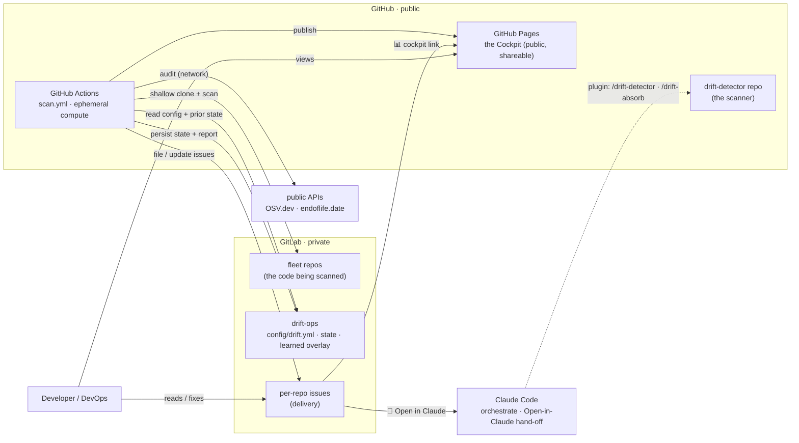
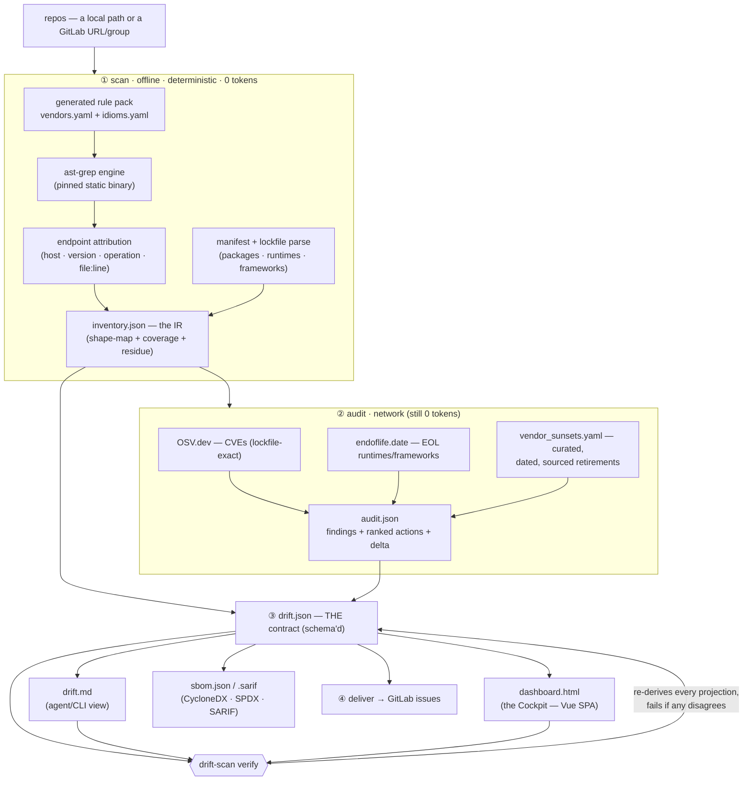
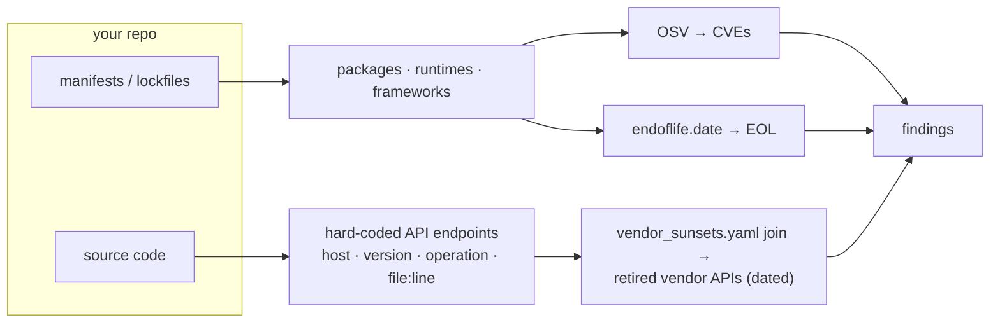
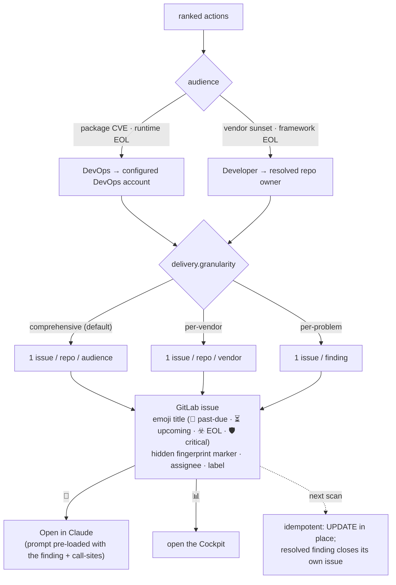

<p align="center">
  
  <br><em>The scanner <b>adapts</b> to every integration shape it's shown — codename <b>Mahoraga, the Wheel</b> (see <a href="#detection-layers--what-it-can-see">Detection</a>).</em>
</p>

# Drift Detector

> **Know before it breaks.**
> It names the dying, sunset, and end-of-life third-party APIs in your repos — with dates —
> before they break in production.

**A DevSecOps supply-chain scanner for third-party integrations.** In one deterministic,
zero-LLM-token pass it does **SBOM + SCA** — a CycloneDX **SBOM** of every component, **SCA**
against **OSV** CVEs and **endoflife.date** EOL — *plus* the layer no SBOM or CVE scanner has:
which third-party **APIs your code calls, at `file:line`**, and when the vendor **retires**
them (**vendor-API sunsets**). Every finding is dated and sourced; every report is
`verify`-certified; where it's blind, it says so.

Packages are the demo; **retired-API detection is the point** — it flags *"eBay's Finding API,
called at `src/Ebay/…:37`, was decommissioned 2025-02-05; migrate to Browse API."* It ships as a
**Claude Code plugin** but the scan is pure Python + the ast-grep static binary — **zero LLM
tokens**; Claude only orchestrates.

- **Runtime:** Python **stdlib + PyYAML only**, plus the **ast-grep** static binary (pinned).
- **Scale:** ~9.6k production LOC, **832 tests** (~12s, no network — all I/O is injected).
- **Determinism:** same `(inventory, audit, now)` → **byte-identical** output. No wall-clock in logic.

> This README is the **core reference** — pitch, quickstart, and the full architecture. For working
> conventions see [CLAUDE.md](CLAUDE.md); for the plugin internals see [docs/PLUGIN.md](docs/PLUGIN.md).

---

## Install

```
/plugin marketplace add https://github.com/laxit-patel/drift-detector
/plugin install drift-detector@tops-tools
```

Prerequisite: **`uv`** (recommended — https://docs.astral.sh/uv/) *or* Python ≥ 3.11 with `venv`,
plus internet on the first run. The bundled runner provisions its own venv + scan engine — no
manual Python or ast-grep install. Check your machine any time: `/drift-detector doctor`.

## Use

```
/drift-detector <folder>              # scan one folder of repos (recursive)
/drift-detector ~/work ~/personal     # or several folders at once
/drift-detector audit <folder>        # what's risky / what to mend
```

- Git repos are discovered **recursively** at any depth (skipping `node_modules`, `vendor`, …).
- The **first run** is a baseline; **later runs lead with what drifted** — new/removed APIs, version
  bumps (e.g. SP-API v0→v2), SDK and runtime changes.
- Ask follow-ups in chat (*"which repos use Amazon SP-API?"*) — answered from the saved inventory,
  without re-scanning.

The **audit** classifies each finding **DEPRECATED** (act now) / **REVIEW** (assess), each with a
cited source, against three feeds: **OSV.dev** (CVEs, lockfile-exact where a lockfile exists),
**endoflife.date** (EOL runtimes/frameworks), and the curated **`agent/vendor_sunsets.yaml`**
catalog joined against your endpoint inventory (the thing package/CVE scanners can't see; entries
can be domain- or operation-scoped so a dead legacy host is flagged without false-flagging a live
one that shares its version string).

---

## Architecture

The heart of the tool. The **scan** is offline, deterministic, and spends **zero LLM tokens**; the
**audit** adds network lookups; everything downstream is a projection of one contract.

### System topology — who runs what, where

The scanner code is public (GitHub); the code it scans and the fleet config are private (GitLab);
the report is public (GitHub Pages). No self-hosted runner, no container registry.



GitHub gives free ephemeral compute + Pages; GitLab holds the private client repo names, the fleet
config, and the durable state/overlay. The scanner never needs a server — it runs, delivers,
persists, and exits. Claude only orchestrates + provides the one-click hand-off; it is **not** in
the scan path.

### The pipeline — scan → audit → render → deliver



Artifacts land in `<state>/` (`<folder>/.drift-detector/` for a local run):

| File | Role |
|---|---|
| `inventory.json` | The **IR** — per-repo `{runtimes, frameworks, sdks, endpoints[…file:line…]}` + rollups + coverage grade. The queryable shape-map. |
| `audit.json` | Findings + **ranked actions** (30 CVEs on one package = **one** job) + week-over-week delta. |
| **`drift.json`** | **The one contract** — canonical, schema'd ([`docs/schema/drift-v1.schema.json`](docs/schema)). Every other surface is a *verified projection* of it. |
| `dashboard.html` | The **Cockpit** — a self-contained Vue SPA (below). |
| `drift.md` | The primary agent/CLI-readable view. |
| `sbom.json` / `*.sarif` | CycloneDX/SPDX SBOM + SARIF — standard supply-chain exports. |
| `probabilistic.html` | *Only* with the opt-in AI cross-check — a separate `AI · unverified` report, outside the `verify` contract. |

Re-runs are cheap: only repos whose git `HEAD` changed are re-analyzed (per-repo commit-SHA cache).

### The one contract + `verify` — why you can trust it

`drift.json` is the **single source of truth**; `drift.md`, `dashboard.html`, the SBOM and the
delivery are all *projections* of it. **`drift-scan verify` re-derives each projection and fails if
any disagrees** — it is the only claim the tool (or a maintainer) may make that a report is correct.
"It looks right" is not allowed; the dashboard is rendered HTML nobody can eyeball for parity.

What `verify` mechanically enforces (`agent/lib/verify.py`):

- **blob parity** — the JSON embedded in `dashboard.html` **equals** `drift.json`, byte-for-byte.
- **tile ↔ table parity** — every dashboard tile's number equals the rows its own filter yields.
- **accessor coverage** — the client reads no field the payload lacks (no silently-blank column).
- **timeline lanes** — the Retirement Timeline renders **both** the dated axis **and** the undated
  lane, so a `deprecated-no-date` sunset can never be silently dropped.
- **Markdown / SBOM parity** — `drift.md` tables and the CycloneDX SBOM re-derive from the payload.

**The five non-negotiable principles**

1. **"Cannot see" ≠ "clean".** A scan that reads nothing says so and exits non-zero — never a green
   checkmark. Verdicts are KNOWN/UNKNOWN per repo, CURRENT/STALE/UNAUDITED per vendor.
2. **Never invent a date.** Every retirement carries a `source:` URL fetched *that session*; undated
   deprecations say so. The `absorb` gate refuses a date with no source.
3. **Deterministic, zero tokens in the scan path.** Same inputs → byte-identical output; the engine
   is version-pinned so two machines agree.
4. **The catalog is data, reviewed.** Vendors/sunsets/idioms enter *only* through staging + the
   `drift-scan absorb` gate — never a direct edit.
5. **Prove a guard against its bug.** A verify invariant must be shown to FAIL on its target bug.

### Detection layers — what it can see

Packages are the demo; **retired-API detection is the point.** No SBOM or CVE scanner has the
endpoint layer.



- **Manifest/SCA** — declared deps → **OSV** CVEs (lockfile-exact) and **endoflife.date** EOL.
  Standard, but only direct deps.
- **Endpoint layer (the moat)** — ast-grep matches call-sites against a generated rule pack; the
  **vendor-sunset catalog** is joined on `(vendor, operation | domain | version)` so it flags
  *"eBay `GetCategoryFeatures` — called at `EbayCategoryFieldsFeature.php:72` — decommissioned
  2026-06-04"* — the thing package scanners can't see.
- **Idiom families** (`idioms.yaml`, a *closed* set implemented in code, whose *instances* are data):
  `url-assembly` (config-injected `getHost() . $path` wrappers), `operation-marker` (one host, many
  operations on independent lifecycles — e.g. eBay Trading), `path-constant`. This is how detection
  "gets smarter" without new code — new instances are reviewed YAML.

> **🎡 Codename: Mahoraga — *the Wheel*.** The `absorb` gate + idiom families are the tool's
> **adaptation engine**. Like Mahoraga adapting to any phenomenon it has faced, Drift Detector adapts
> to every integration shape it is *shown* — and thereafter detects it deterministically, forever.
> The twist that makes it *trustworthy*: it never adapts **autonomously**. The Wheel turns only by
> passing the deterministic `absorb` gate — sourced dates, no false endpoints, residue must strictly
> shrink. Adaptation, disciplined. *(Mahoraga — the Wheel — is the tool's spirit: the part that
> learns.)*

<p align="center">
  
  <br><em>“Nah, I'd adapt.” — every new integration shape turns the Wheel through the <code>absorb</code> gate.</em>
</p>

**Where it is blind, it says so:** unreadable languages, config-driven URLs it can't follow, private
sub-dependencies it can't crawl, and unreachable repos all surface as explicit UNKNOWN / unscannable
rows — counted, never hidden.

### Delivery — findings to the right human, idempotently

Findings roll up into **ranked actions**, split by audience, and become GitLab issues filed **in the
flagged repo's own tracker** (the ticket lives with the code).



- **Idempotent by construction** — each issue carries `<!-- drift-detector:<fp> -->`; a re-run
  matches by fingerprint and **updates in place**, never duplicates; a resolved finding **closes
  itself**. Switching granularity cleanly closes old-shape issues and opens the new-shape ones.
- **Aggregation is native GitLab** — a group issue board on the `drift:devops` / `drift:developer`
  labels is the queue; nothing custom to build. Findings are **issues only, no MRs**.
- **One-click hand-off** — every issue carries a 🤖 **Open in Claude** deep-link that pre-loads the
  finding (dying API, dated retirement, call-sites, recommendation, source) into Claude Code, and a
  📊 link to the public Cockpit.
- **Configured entirely in `drift.yml`** (a reviewed commit in the private drift-ops repo):

```yaml
delivery:
  mode: create                 # dry-run | create | off
  granularity: per-problem      # comprehensive (default) | per-vendor | per-problem
  devops:    { assignee: ops-bot }
  developer: { fallbackAssignee: tech-lead }   # else the resolved repo owner
```

### The Cockpit — a verified projection you can share

`dashboard.html` is a **single self-contained file** (Vue runtime + CSS + app + the `drift.json` blob
all inlined; **no CDN, no build, opens from `file://`**, emails as one attachment), published to
GitHub Pages.

- **Vendored Vue** (pinned + provenance) — zero-build, zero external fetch; the renderer is a thin
  injector, the page hydrates client-side.
- **Information architecture:** the metric **tiles are the primary tabs**; a **hero chart** (the
  per-operation **Retirement Timeline** — every dying API on a date axis, past-due left of a
  deterministic "today" line) sits where cards used to; **Summary / SBOM / SARIF are sub-tabs**.
- **Deep-linkable** (`?repo=&tab=&sub=`) so an issue links straight to a filtered view.
- Still a **verified projection**: the embedded blob equals `drift.json`, and `verify` proves it.

---

## SBOM · SARIF exports

```
drift-scan sbom --state <dir>          # writes <state>/sbom.json (CycloneDX 1.5)
```

A standard **CycloneDX** SBOM for the whole fleet — every component (packages, runtimes, frameworks,
each with a **PURL** and the repos it appears in) plus the **OSV CVE** findings as `vulnerabilities`
(**SBOM + SCA + VEX** in one file) for EO 14028 / EU CRA compliance — plus **SPDX** and **SARIF**
(file:line results → GitHub code scanning, VS Code). Each is a **verified projection** of the scan;
`verify` re-derives it and fails if it's stale or hand-edited.

## Probabilistic (AI) cross-check — an opt-in second opinion

The deterministic scan is trustworthy but bounded — it flags only what it can *certify*. You can
**opt into an AI pass** that reads every repo and surfaces integrations the rules can't see
(config-driven URLs, exotic wrappers). Its output is a **separate, clearly-labelled `AI · unverified`
report** (`probabilistic.html`) — **leads, not findings** — that never touches the certified
dashboard or the `verify` contract. Any lead can be **promoted through the deterministic `absorb`
gate** to become certified on the next scan. **AI proposes; the gate certifies.** Off by default;
costs tokens only when you say yes.

## Autonomous & scheduled

`/drift-detector <folder>` runs the full pipeline and then offers to make it autonomous — a **cron
job** (default Sundays 7am) re-running the deterministic pipeline, **no Claude, no tokens**:

```
/drift-detector schedule <folder>      # install the weekly cron (shows the crontab line first)
/drift-detector unschedule <folder>    # remove it
```

For a fleet, `.github/workflows/scan.yml` runs the whole pipeline on ephemeral GitHub compute
(Sundays + manual `workflow_dispatch`), reading the fleet + config from the private `drift-ops` repo
and persisting state back.

---

## What's built (today)

| Capability | Status |
|---|---|
| Deterministic scan (ast-grep, pinned) → inventory IR | ✅ shipped |
| SCA (OSV CVEs) + EOL (endoflife.date) | ✅ shipped |
| **Endpoint layer** + curated **vendor-sunset catalog** (dated, sourced) | ✅ shipped |
| Idiom families + the `absorb` gate (**the Wheel**) | ✅ shipped |
| `drift.json` contract + `verify` (blob/tile/accessor/timeline/md/sbom parity) | ✅ shipped |
| CycloneDX / SPDX SBOM + SARIF exports | ✅ shipped |
| Vue **Cockpit** (tiles-as-tabs, retirement timeline, deep-links) on GitHub Pages | ✅ shipped |
| Delivery: per-repo GitLab issues, 3 granularities, emoji titles, idempotent | ✅ shipped |
| **Open in Claude** hand-off + issue links → public cockpit | ✅ shipped |
| CI: GitHub Actions scan→audit→deliver→publish→persist; scheduled + on-demand | ✅ shipped |
| Opt-in **probabilistic (AI) cross-check** | ✅ shipped (opt-in) |

## What's next (roadmap)

- **The AI two-plane Cockpit** *(next design cycle)* — probabilistic leads shown *beside* certified
  findings in one cockpit, with the certified/unverified **firewall as a structural invariant** (two
  payloads; `verify` governs only the certified plane; an AI lead can never land in a certified tile).
- **Trend history** — the dashboard shows the latest run; week-over-week burn-down needs a multi-run
  archive (a real persistence layer, not faked from one run).
- **Broader fleet access** — today only the repos the scanning token can *read* are covered; the rest
  are flagged blind. Granting the bot read access unlocks the full fleet.
- **More idiom families / vendors** — each new integration shape turns the Wheel through the `absorb`
  gate (a reviewed catalog contribution).
- **The Rust port (banked)** — Rust is the only language that links ast-grep natively; a rewrite is
  the verified end-state, **not** current work. Trigger-gated (single no-network binary demand *or*
  sold as a product) — see [CLAUDE.md](CLAUDE.md). There is **no performance case** (the scan is
  already inside a Rust binary).

---

## Running it (CLI)

```
./bin/drift-scan run    --config drift.yml --state <dir> --now $(date +%F)   # scan→audit→dashboard
./bin/drift-scan verify --state <dir>                                        # the trust gate
./bin/drift-scan deliver --config drift.yml --state <dir> [--dry-run]        # file/update issues
./bin/drift-scan plan   --config drift.yml                                   # preview, no scan
```

Exit codes: `0` ok · `2` error · `3` gate tripped (findings) · `4` couldn't verify / scanned nothing.
`bin/drift-scan` self-bootstraps (fetches the pinned ast-grep engine + a venv). Run the test suite
with `pytest` (needs `pip install -r requirements.txt`); measure the scanner against real public
repos with the evaluation harness — see [docs/EVAL.md](docs/EVAL.md) (`bin/drift-eval`).

## Repo map

```
bin/drift-scan            self-bootstrapping runner (fetches the pinned ast-grep engine + venv)
agent/                    pipeline: inventory_scan · audit · run · deliver(cli) · absorb (the Wheel)
agent/lib/                the pieces — engine, endpoints, classify_url, vendor_rules, idioms,
                          osv, eol, actions, ranking, delivery, verify, dashboard_render, ops_config, …
agent/*.yaml              the reviewed catalogs — vendors · vendor_sunsets · idioms · frameworks ·
                          sdk_profiles · catalog_attestations
agent/assets/             the Cockpit — dashboard.{template.html,app.js,css} + vendored Vue
commands/                 the slash-command promptfiles (/drift-detector · /drift-absorb · /drift-deepen)
.github/workflows/        scan.yml (the scheduled fleet scan) + probe / catalog-check / container
docs/                     schema/ (the contract) · PLUGIN · EVAL · TECH_DEBT
```

## Limits

- Endpoint **version** is best-effort from the URL on the matched line — `None` when a repo builds
  the URL from a base constant with the version appended elsewhere (needs dataflow; out of scope).
- Detects hard-coded endpoints + manifest-declared SDKs. An SDK used only via its client library (no
  hard-coded URL) shows via the manifest, not as a call-site.
- Versions are **lockfile-exact where a lockfile exists**, else the declared manifest floor. Only
  **direct** (manifest-declared) dependencies are audited; transitive lockfile deps are not queried.
- Vulnerability/EOL sources are Tier 1 (OSV + endoflife.date); the vendor-sunset catalog is
  **curated** (you extend it). "Package abandoned/deprecated" (Tier 2) and community/early-warning
  (Tier 3) signals are not yet included.
- The dashboard shows the **latest** run; week-over-week movement comes from the finding delta, not a
  multi-run archive (that's a future layer).

---

*Every finding is dated and sourced; every report is `verify`-certified; where it's blind, it says so.*
🎡 **Know before it breaks.**
