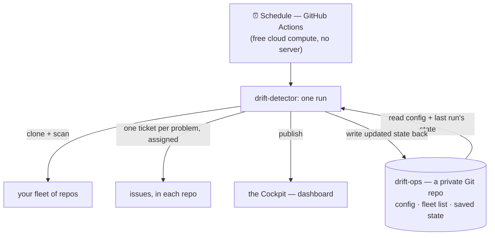
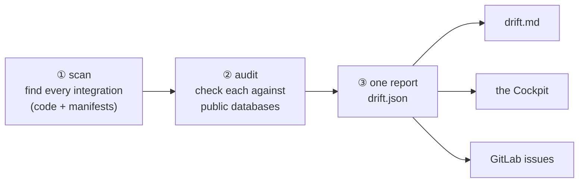
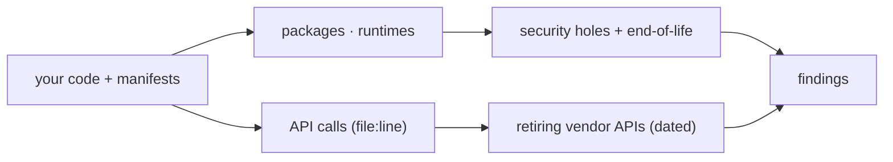

<p align="center">
  
  <br><em>The scanner <b>adapts</b> to every integration shape it's shown — codename <b>Mahoraga, the Wheel</b> (see <a href="#detection--what-it-can-see">Detection</a>).</em>
</p>

# Drift Detector

> **Know before it breaks.**

Drift Detector watches your codebase for third-party integrations that are **about to break** —
and tells you *which file and line* is affected, *with the date* it breaks, **before it does.**

It catches three kinds of rot:

1. **Retired vendor APIs** — a service you call (eBay, Amazon, Shopify, …) is **shutting down** an
   API your code still uses. *Example: "eBay's `GetCategoryFeatures` — called at
   `EbayCategoryFieldsFeature.php:72` — is retired as of 2026‑06‑04; migrate to the Taxonomy API."*
   **No SBOM or CVE scanner sees this** — it's the reason the tool exists.
2. **End-of-life software** — a runtime or framework version the maker no longer supports/patches.
3. **Known security holes** — public vulnerabilities in the packages you depend on.

It runs **on a schedule, by itself**. Each run it files a ticket for every problem it finds — in
the repo that has it, assigned to the right person — and publishes an interactive dashboard.
Nothing to babysit; every finding is **dated, sourced, and self-checked**, and where it *can't*
see, it says so instead of reporting a false all-clear.

### The jargon, once (plain terms)

| Term | In plain English |
|---|---|
| **vendor-API sunset** | A third-party service is retiring an API your code calls. |
| **EOL** (end-of-life) | A software version the maker stopped supporting/patching. |
| **CVE** | A publicly-catalogued security hole in a software package. |
| **OSV** | The public database of those security holes (`osv.dev`) the tool checks against. |
| **SBOM** | A "bill of materials" — the list of every component your code depends on (standard CycloneDX/SPDX files, for compliance). |
| **SARIF** | A standard file format for code-scan results (GitHub code-scanning and VS Code read it). |
| **the Cockpit** | The interactive dashboard the tool publishes each run. |

- **How it runs:** cloud compute on a schedule — **no server to operate.**
- **What it's made of:** Python (stdlib only) + the **ast-grep** code-search engine. **Zero AI/LLM
  tokens** in the scan.
- **Trustworthy by construction:** same inputs → identical output; every report is machine-verified
  before it's shown.

> Where it's going (the Rust rewrite, the longer-term plan): **[docs/ROADMAP.md](docs/ROADMAP.md)**.

---

## How it works — the one model

You don't operate it hands-on. You **configure it once** and it runs itself on a schedule.



Two moving parts, clear roles:

- **The compute (GitHub Actions)** is just the *muscle* — it spins up, runs one scan, and
  disappears. There is **no always-on server.**
- **The `drift-ops` repo (on your GitLab) is the *brain*.** This is the "state repo" that stores
  everything the tool remembers between runs: the **config** (`drift.yml`), the **fleet** (which
  repos to scan), the **saved state** (last scan's results + the learned catalog), and it's where
  the **Cockpit is published from**. Each run reads from it and writes updated state back to it.

So the mental model is: **a scheduled robot that reads its instructions and memory from one private
Git repo, scans your other repos, and drops the results (tickets + dashboard) where your team
already works.** It is *not* a chat tool or a thing you invoke per-question.

---

## Configure it — `drift.yml`

`drift.yml` lives in the `drift-ops` repo and is the **one control surface** — everything the tool
does is set here (a reviewed commit, never a secret in the file):

```yaml
version: 1

# WHICH repos to scan — the "fleet". All https URLs on one host.
# A GROUP url scans every repo under it.
fleet:
  - https://git.example.com/team/service-a
  - https://git.example.com/team/service-b
  - https://git.example.com/platform            # a whole group

delivery:
  mode: create            # dry-run (print the plan, write nothing) · create (file issues) · off
  granularity: per-problem # how findings become tickets — see below
  devops:                 # DevOps tickets = package security + end-of-life
    assignee: ops-bot     #   assigned to this account (required when filing issues)
  developer:              # Developer tickets = retiring vendor APIs + framework EOL
    fallbackAssignee: lead #   auto-assigned to the repo's owner; this is the fallback

# Optional. `auth` holds env-var NAMES (never the secret itself); omit to use one GITLAB_TOKEN.
# notify: { gchat: GCHAT_WEBHOOK }
```

- **`mode`** — `dry-run` prints what it *would* file (safe to try); `create` actually files/updates
  issues; `off` skips delivery.
- **`granularity`** — how many tickets a repo's findings become:
  - `comprehensive` — **2 tickets per repo** (one DevOps, one Developer), each listing everything.
  - `per-vendor` — **one ticket per vendor** per repo (all dying eBay calls together, etc.).
  - `per-problem` — **one ticket per finding** (every dying API / package / EOL gets its own).
- **`devops` / `developer`** — the two audiences. Package-security & runtime-EOL tickets go to the
  DevOps account; retiring-vendor-API & framework-EOL tickets go to the **repo's owner** (resolved
  automatically), falling back to `fallbackAssignee`.

Re-runs **update tickets in place** (never duplicates); a fixed problem **closes its own ticket.**

---

## Try it locally (optional)

To evaluate it on a folder of repos without any of the scheduled/fleet setup:

```
./bin/drift-scan run    --root ~/some/repos --state /tmp/out --now $(date +%F)   # scan → dashboard
./bin/drift-scan verify --state /tmp/out                                         # the trust check
```

`bin/drift-scan` provisions its own Python venv + the scan engine on first run. Open
`/tmp/out/dashboard.html` in a browser. (Exit codes: `0` ok · `2` error · `3` found problems · `4`
couldn't scan / couldn't verify.)

---

## Architecture

The pipeline is **offline and deterministic** — same inputs produce byte-identical output, and it
spends **zero AI tokens.** Only the "audit" step reaches the network (to public databases).



**① scan** — the [ast-grep](https://ast-grep.github.io) engine (a pinned static binary) finds the
third-party API calls in your source down to `file:line`, and manifest/lockfile parsing finds your
packages, runtimes, and frameworks. Output: `inventory.json` (the map of what you use).

**② audit** — each thing found is checked against three sources, and classified **act-now** or
**review**, always with a cited link:
- **OSV.dev** → known security holes (CVEs) per package version;
- **endoflife.date** → end-of-life runtimes/frameworks;
- **the vendor-sunset catalog** (`agent/vendor_sunsets.yaml`) → a **curated, dated, sourced** list
  of retiring vendor APIs, matched against the API calls found in step ①. *This is the layer no
  other scanner has.*

**③ one report** — everything becomes `drift.json`, the **single source of truth.** The
human-readable `drift.md`, the Cockpit dashboard, the SBOM, and the filed issues are all
**projections** of it.

### Why you can trust it — `verify`

`drift-scan verify` **re-derives every projection from `drift.json` and fails if any disagrees.**
A green `verify` is the *only* claim the tool makes that a report is correct — nobody eyeballs the
dashboard for accuracy. It checks the dashboard's embedded data matches the report exactly, that
every dashboard tile's number equals the rows it filters to, and that nothing dated is silently
dropped. Two guarantees underpin everything:

- **"Cannot see" is never "clean."** If it can't read a repo (no access, unknown language), it says
  so and exits non-zero — never a false green checkmark.
- **Never invent a date.** Every retirement carries a source link fetched that run; undated ones
  say "no date announced." Nothing enters the catalog without passing a review gate.

### Detection — what it can see

Packages and security holes are table stakes. The **differentiator is the vendor-API layer**: it
knows *which third-party APIs your code calls* and *when the vendor kills them.*



It keeps up with new integration shapes through an **adaptation engine** — codename **Mahoraga, the
Wheel**: the shapes it's taught (as reviewed catalog data, never code) it detects deterministically
forever after; it never adapts on its own — every new shape passes a review gate first.

<p align="center">
  
  <br><em>“Nah, I'd adapt.” — every new integration shape turns the Wheel through the review gate.</em>
</p>

### Delivery & the Cockpit

Findings roll up into **ranked jobs** (thirty security holes in one package = **one** upgrade job,
not thirty tickets), split by audience, and filed **in each repo's own tracker** — idempotently
(re-runs update in place; fixed problems auto-close). Each ticket carries an emoji-coded title
(🚨 past-due · ⏳ upcoming · ☣️ end-of-life · 🛡️ security), a 📊 link to the Cockpit, and a 🤖
**Open in Claude** link that pre-loads the finding so whoever picks it up gets full context.

The **Cockpit** is the interactive dashboard — clickable tiles, a per-operation **retirement
timeline**, and the drill-down list, published as a static site from the `drift-ops` repo.

---

## Outputs

| File | What it is |
|---|---|
| `inventory.json` | The map of everything your repos use (packages, runtimes, API calls at `file:line`). |
| `audit.json` | The findings + ranked jobs + what changed since last run. |
| **`drift.json`** | **The one report** everything else is derived from (and `verify`-checked against). |
| `dashboard.html` | The **Cockpit** — the interactive dashboard. |
| `drift.md` | The plain-text version of the report. |
| `sbom.json` / `*.sarif` | Standard SBOM (CycloneDX/SPDX) + SARIF exports for compliance/other tools. |

## What's built today

| Capability | Status |
|---|---|
| Deterministic scan → inventory of packages, runtimes & API calls (`file:line`) | ✅ |
| Security-hole (OSV) + end-of-life (endoflife.date) checks | ✅ |
| **Retiring-vendor-API detection** + the curated, dated, sourced catalog | ✅ |
| The adaptation engine (idiom families + review gate — *the Wheel*) | ✅ |
| `drift.json` + `verify` (the trust contract) | ✅ |
| SBOM (CycloneDX/SPDX) + SARIF exports | ✅ |
| The Cockpit dashboard (tiles, retirement timeline, deep-links) | ✅ |
| Scheduled delivery: per-repo issues, 3 granularities, idempotent, "Open in Claude" | ✅ |

Where it's headed next: **[docs/ROADMAP.md](docs/ROADMAP.md)**.

---

## Repo map

```
bin/drift-scan       self-provisioning runner (fetches the pinned scan engine + a venv)
agent/               the pipeline: scan · audit · run · deliver · absorb (the Wheel)
agent/lib/           the pieces — engine, endpoint detection, OSV/EOL, ranking, delivery, verify, dashboard, config
agent/*.yaml         the reviewed catalogs — vendors · vendor_sunsets · idioms · frameworks
agent/assets/        the Cockpit — dashboard template + app + vendored runtime
.github/workflows/   scan.yml (the scheduled run)
docs/                ROADMAP.md · PLUGIN.md · EVAL.md · schema/ (the drift.json contract)
```

Working conventions for contributors: **[CLAUDE.md](CLAUDE.md)**.

## Limits (honest scope)

- API **version** is read from the URL on the matched line; it's `None` when a repo builds the URL
  from a base constant elsewhere (would need dataflow — out of scope).
- Only **directly-declared** dependencies are audited (not transitive ones pulled in by lockfiles).
- Security/EOL sources are OSV + endoflife.date; the vendor-sunset catalog is **curated** — you
  extend it (each entry cites a source).
- The dashboard shows the **latest** run; week-over-week history is a future layer (see the roadmap).

---

*Every finding is dated and sourced; every report is `verify`-certified; where it's blind, it says so.*
🎡 **Know before it breaks.**
