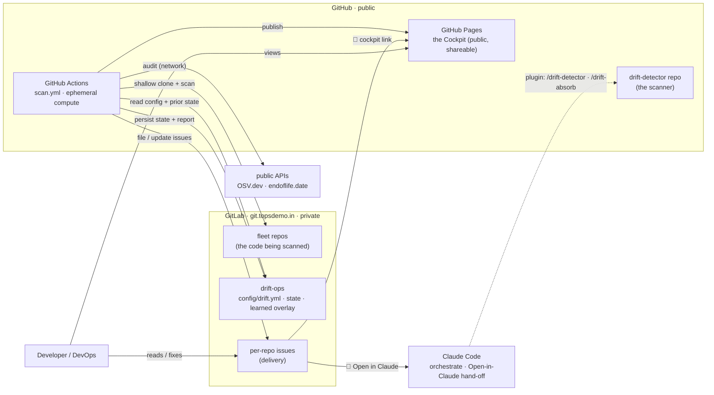
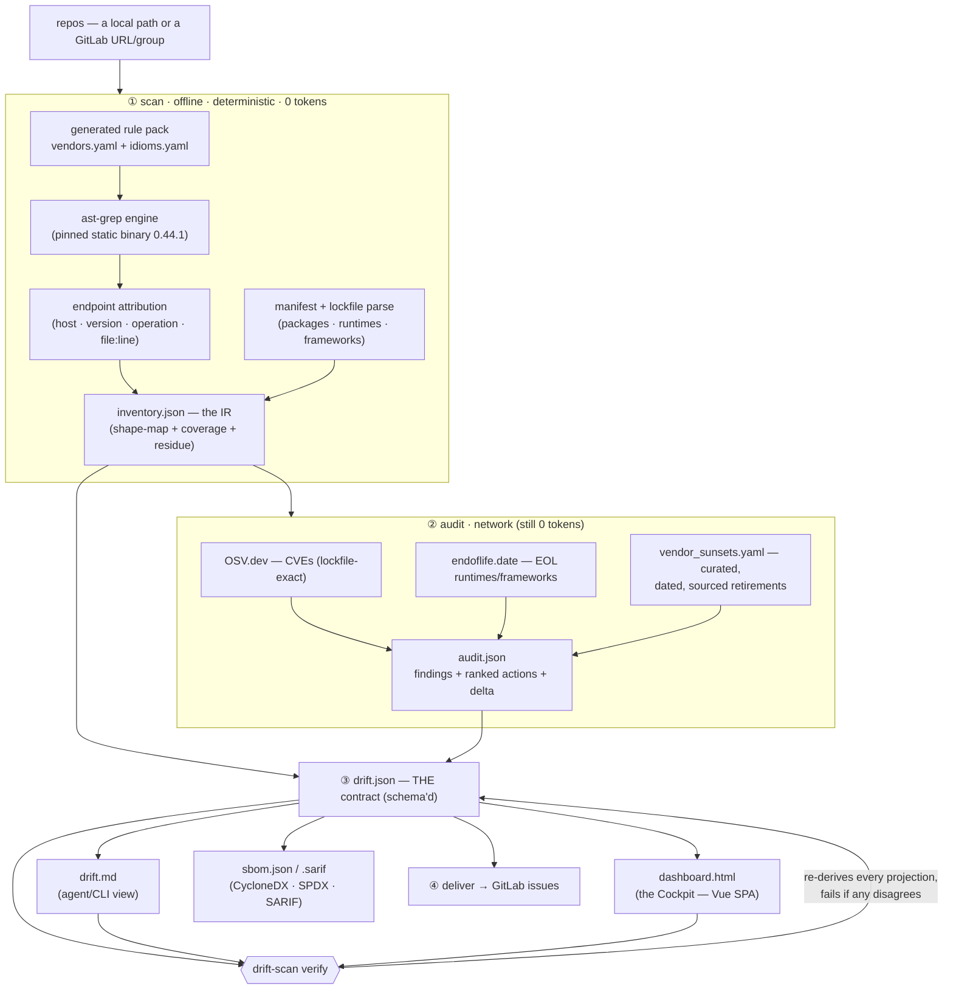
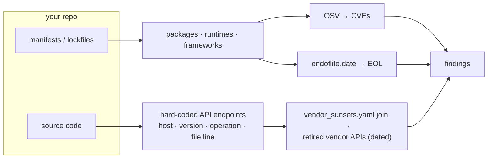
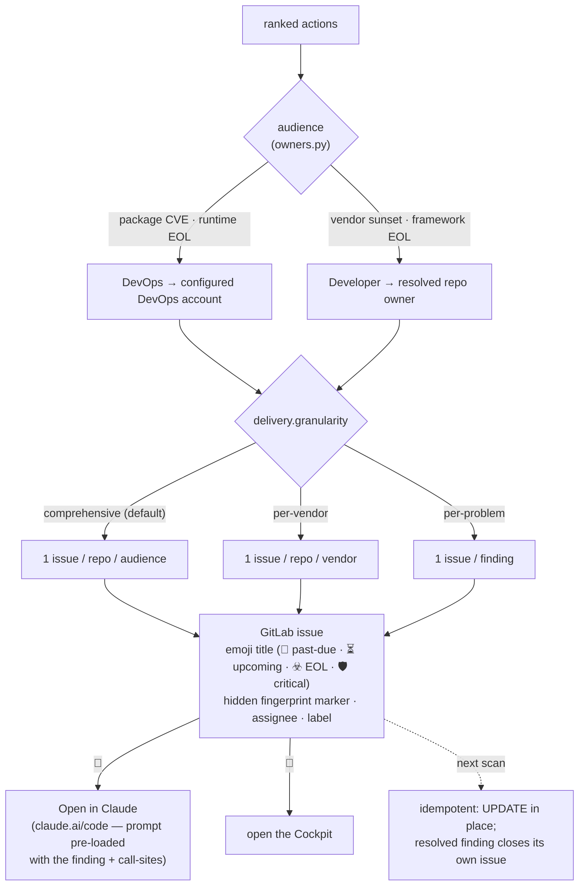

<p align="center"></p>

# Drift Detector — Architecture

> 🔮 **Ashen Oracle** — *Know before it breaks.*
> This is the core reference: **what it is, how it's built, how it works, how to use it, and where
> it's going.** For the product pitch see [README](../README.md); for working conventions see
> [CLAUDE.md](../CLAUDE.md).

Drift Detector is a **deterministic, zero-LLM-token DevSecOps scanner** for dying third-party API
integrations. In one offline pass it builds a code-level inventory of the integrations your repos
use — packages, runtimes, frameworks, and the **API endpoints your code actually calls, at
`file:line`** — then audits them against public advisories and a **curated, dated, sourced
vendor-sunset catalog**, and files the result as GitLab issues and a public dashboard. Where it is
blind, it says so and exits non-zero. **"Cannot see" is never "clean."**

- **Runtime:** Python **stdlib + PyYAML only** (no framework), plus the **ast-grep** static binary.
- **Scale:** ~9.6k production LOC, **832 tests** (~12s, no network — all I/O is injected).
- **Determinism:** same `(inventory, audit, now)` → **byte-identical** output. No wall-clock in logic.

---

## 1. System topology — who runs what, where

The scanner code is public (GitHub); the code it scans and the fleet config are private (GitLab);
the report is public (GitHub Pages). No self-hosted runner, no container registry.



**Why this split:** GitHub gives free ephemeral compute + Pages; GitLab holds the private client
repo names, the fleet config, and the durable state/overlay. The scanner never needs a server —
it runs, delivers, persists, and exits. Claude only orchestrates and provides the one-click
hand-off; it is **not** in the scan path.

---

## 2. The pipeline — scan → audit → render → deliver

The heart of the tool. The **scan** is offline, deterministic, and spends **zero LLM tokens**; the
**audit** adds network lookups; everything downstream is a projection of one contract.



Artifacts land in `<state>/`:

| File | Role |
|---|---|
| `inventory.json` | The **IR** — per-repo `{runtimes, frameworks, sdks, endpoints[…file:line…]}` + rollups + coverage grade. The queryable shape-map. |
| `audit.json` | Findings + **ranked actions** (30 CVEs on one package = **one** job) + week-over-week delta. |
| **`drift.json`** | **The one contract** — canonical, schema'd ([`docs/schema/drift-v1.schema.json`](schema)). Every other surface is a *verified projection* of it. |
| `dashboard.html` | The **Cockpit** — a self-contained Vue SPA (see §6). |
| `drift.md` | The primary agent/CLI-readable view. |
| `sbom.json` / `*.sarif` | CycloneDX/SPDX SBOM + SARIF — standard supply-chain exports. |

---

## 3. The one contract + `verify` — why you can trust it

`drift.json` is the **single source of truth**. `drift.md`, `dashboard.html`, the SBOM and the
delivery are all *projections* of it. **`drift-scan verify` re-derives each projection and fails if
any disagrees** — it is the only claim the tool (or a maintainer) may make that a report is correct.
"It looks right" is not allowed; the dashboard is rendered HTML nobody can eyeball for parity.

What `verify` mechanically enforces (`agent/lib/verify.py`):

- **blob parity** — the JSON embedded in `dashboard.html` **equals** `drift.json`, byte-for-byte.
- **tile ↔ table parity** — every dashboard tile's number equals the rows its own filter yields.
- **accessor coverage** — the client reads no field the payload lacks (no silently-blank column).
- **timeline lanes** — the Retirement Timeline renders **both** the dated axis **and** the undated
  lane, so a `deprecated-no-date` sunset can never be silently dropped ("cannot see ≠ clean").
- **Markdown / SBOM parity** — `drift.md` tables and the CycloneDX SBOM re-derive from the payload.

Each guard was **proven against the bug it targets** before it shipped (project principle 5).

### The five non-negotiable principles

1. **"Cannot see" ≠ "clean".** A scan that reads nothing says so and exits non-zero — never a green
   checkmark. Verdicts are KNOWN/UNKNOWN per repo, CURRENT/STALE/UNAUDITED per vendor.
2. **Never invent a date.** Every retirement carries a `source:` URL fetched *that session*; undated
   deprecations say so. The `absorb` gate refuses a date with no source.
3. **Deterministic, zero tokens in the scan path.** Same inputs → byte-identical output; the engine
   is version-pinned so two machines agree.
4. **The catalog is data, reviewed.** Vendors/sunsets/idioms enter *only* through staging + the
   `drift-scan absorb` gate — never a direct edit.
5. **Prove a guard against its bug.** A verify invariant must be shown to FAIL on its target bug.

---

## 4. Detection layers — what it can see

Packages are the demo; **retired-API detection is the point.** No SBOM or CVE scanner has the
endpoint layer.



- **Manifest/SCA** — declared deps → **OSV** CVEs (lockfile-exact where a lockfile exists) and
  **endoflife.date** EOL. Standard, but only direct deps.
- **Endpoint layer (the moat)** — ast-grep matches call-sites against a generated rule pack; the
  **vendor-sunset catalog** is joined on `(vendor, operation | domain | version)` so it flags
  *"eBay `GetCategoryFeatures` — called at `EbayCategoryFieldsFeature.php:72` — decommissioned
  2026-06-04"* — the thing package scanners can't see.
- **Idiom families** (`idioms.yaml`, a *closed* set implemented in code, whose *instances* are data):
  `url-assembly` (config-injected `getHost() . $path` wrappers), `operation-marker` (one host, many
  operations on independent lifecycles — e.g. eBay Trading), `path-constant`. This is how detection
  "gets smarter" without new code — new instances are reviewed YAML.

**Where it is blind, it says so:** unreadable languages, config-driven URLs it can't follow, private
sub-dependencies it can't crawl, and unreachable repos all surface as explicit UNKNOWN / unscannable
rows — counted, never hidden.

---

## 5. Delivery — findings to the right human, idempotently

Findings roll up into **ranked actions**, split by audience, and become GitLab issues filed **in the
flagged repo's own tracker**. Granularity is configurable (`agent/lib/delivery.py`, `ops_config.py`).



- **Idempotent by construction** — each issue carries `<!-- drift-detector:<fp> -->`; a re-run matches
  by fingerprint and **updates in place**, never duplicates; a resolved finding **closes itself**.
  Switching granularity cleanly closes the old-shape issues and opens the new-shape ones.
- **Aggregation is native GitLab** — a group issue board on the `drift:devops` / `drift:developer`
  labels is the queue; nothing custom to build.
- **Configured entirely in `drift.yml`** (a reviewed commit in the private drift-ops repo):

```yaml
delivery:
  mode: create                 # dry-run | create | off
  granularity: per-problem      # comprehensive | per-vendor | per-problem
  devops:    { assignee: ops-bot }
  developer: { fallbackAssignee: tech-lead }   # else the resolved repo owner
```

---

## 6. The Cockpit — a verified projection you can share

`dashboard.html` is a **single self-contained file** (Vue runtime + CSS + app + the `drift.json` blob
all inlined; **no CDN, no build, opens from `file://`**), published to GitHub Pages.

- **Vendored Vue** (`agent/assets/vendor/vue.global.prod.js`, pinned + provenance) — zero-build, zero
  external fetch. The renderer (`dashboard_render.py`) is a thin injector; the page hydrates client-side.
- **Information architecture:** the metric **tiles are the primary tabs**; a **hero chart** (the
  per-operation **Retirement Timeline** — every dying API on a date axis, past-due left of a
  deterministic "today" line) sits where cards used to; **Summary / SBOM / SARIF are sub-tabs**.
- **Deep-linkable** (`?repo=&tab=&sub=`) so an issue links straight to a filtered view.
- Still a **verified projection**: the embedded blob equals `drift.json`, and `verify` proves it.

---

## 7. What's built (today)

| Capability | Status |
|---|---|
| Deterministic scan (ast-grep, pinned) → inventory IR | ✅ shipped |
| SCA (OSV CVEs) + EOL (endoflife.date) | ✅ shipped |
| **Endpoint layer** + curated **vendor-sunset catalog** (dated, sourced) | ✅ shipped |
| Idiom families (`url-assembly`, `operation-marker`, `path-constant`) + `absorb` gate | ✅ shipped |
| `drift.json` contract + `verify` (blob/tile/accessor/timeline/md/sbom parity) | ✅ shipped |
| CycloneDX / SPDX SBOM + SARIF exports | ✅ shipped |
| Vue **Cockpit** (tiles-as-tabs, retirement timeline, deep-links) on GitHub Pages | ✅ shipped |
| Delivery: per-repo GitLab issues, 3 granularities, emoji titles, idempotent | ✅ shipped |
| **"Open in Claude"** hand-off + issue links → public cockpit | ✅ shipped |
| CI: GitHub Actions scan→audit→deliver→publish→persist; scheduled + on-demand | ✅ shipped |
| Opt-in **probabilistic (AI) cross-check** — a separate `AI · unverified` report | ✅ shipped (opt-in) |

---

## 8. What's next (roadmap)

- **③ The AI two-plane Cockpit** *(next design cycle)* — probabilistic leads shown *beside* certified
  findings in one cockpit, with the certified/unverified **firewall as a structural invariant** (two
  payloads; `verify` governs only the certified plane; an AI lead can never land in a certified tile).
- **Trend history** — the dashboard shows the latest run; week-over-week burn-down needs a multi-run
  archive (a real persistence layer, not faked from one run).
- **Broader fleet access** — today only the repos the scanning token can *read* are covered; the rest
  are flagged blind. Granting the bot read access unlocks the full fleet.
- **More idiom families / vendors** — each new integration shape is a reviewed catalog contribution
  through the `absorb` gate.
- **The Rust port (banked)** — Rust is the only language that links ast-grep natively; a rewrite is the
  verified end-state, **not** current work. Trigger-gated (single no-network binary demand *or* sold as
  a product) — see [CLAUDE.md](../CLAUDE.md#the-rust-port). There is **no performance case** (the scan is
  already inside a Rust binary).

---

## 9. How to use it

**As a Claude Code plugin** (interactive):
```
/plugin marketplace add https://github.com/laxit-patel/drift-detector
/plugin install drift-detector@tops-tools
/drift-detector <folder>          # scan a folder of repos (recursive)
/drift-detector audit <folder>    # what's risky / what to mend
```
Prereq: **`uv`** or Python ≥ 3.11; the bundled runner provisions its own venv + the ast-grep engine.

**As a CLI** (what CI runs):
```
./bin/drift-scan run    --config drift.yml --state <dir> --now $(date +%F)   # scan→audit→dashboard
./bin/drift-scan verify --state <dir>                                        # the trust gate
./bin/drift-scan deliver --config drift.yml --state <dir>                    # file/update issues
./bin/drift-scan plan   --config drift.yml                                   # preview, no scan
```
Exit codes: `0` ok · `2` error · `3` gate tripped (findings) · `4` couldn't verify / scanned nothing.

**As scheduled CI** — `.github/workflows/scan.yml` runs the whole pipeline on ephemeral GitHub
compute (Sundays + manual `workflow_dispatch`), reading the fleet + config from the private
`drift-ops` repo and persisting state back. Zero AI, zero tokens.

---

## 10. Repo map

```
bin/drift-scan            self-bootstrapping runner (fetches the pinned ast-grep engine + venv)
agent/                    pipeline: inventory_scan · audit · run · deliver(cli) · absorb
agent/lib/                the pieces — engine, endpoints, classify_url, vendor_rules, idioms,
                          osv, eol, actions, ranking, delivery, verify, dashboard_render, ops_config, …
agent/*.yaml              the reviewed catalogs — vendors · vendor_sunsets · idioms · frameworks ·
                          sdk_profiles · catalog_attestations
agent/assets/             the Cockpit — dashboard.{template.html,app.js,css} + vendored Vue
commands/                 the slash-command promptfiles (/drift-detector · /drift-absorb · /drift-deepen)
.github/workflows/        scan.yml (the scheduled fleet scan) + probe / catalog-check / container
docs/                     schema/ (the contract) · ARCHITECTURE.md (this) · PLUGIN · EVAL · TECH_DEBT
```

---

*Every finding is dated and sourced; every report is `verify`-certified; where it's blind, it says so.*
🔮 **Know before it breaks.**
